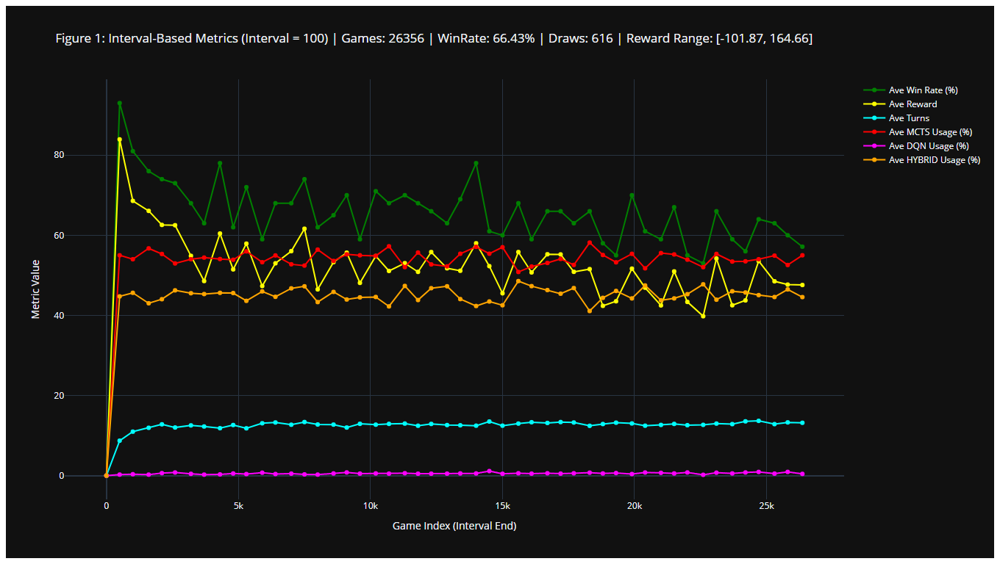
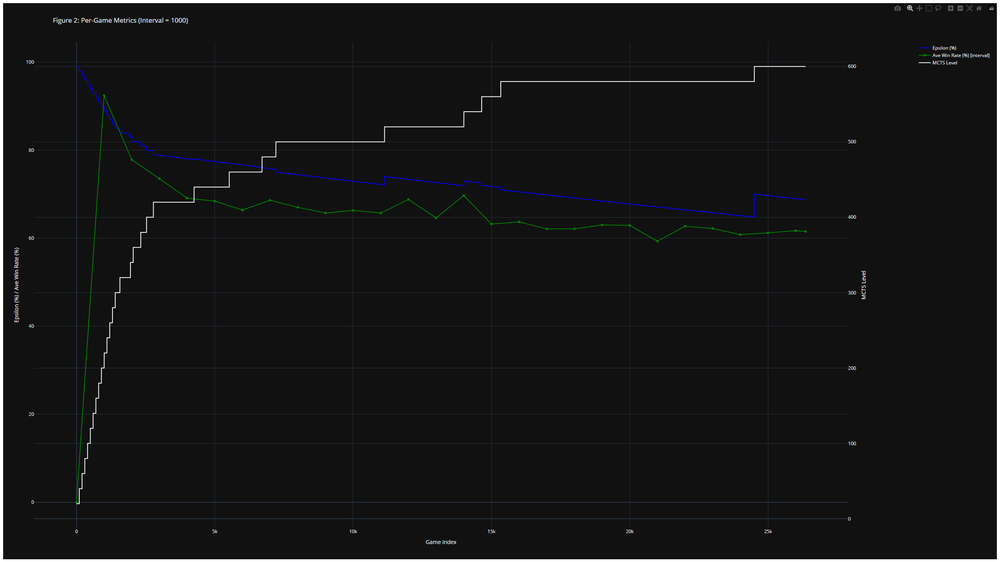
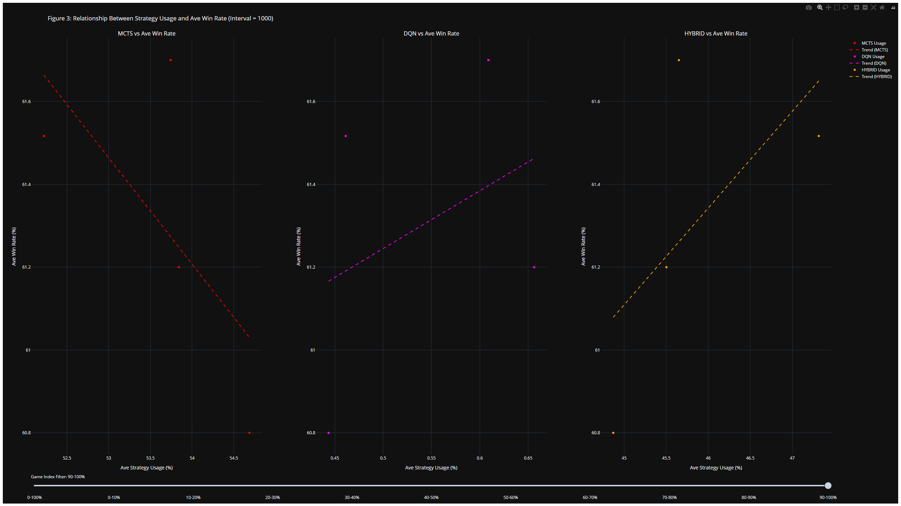
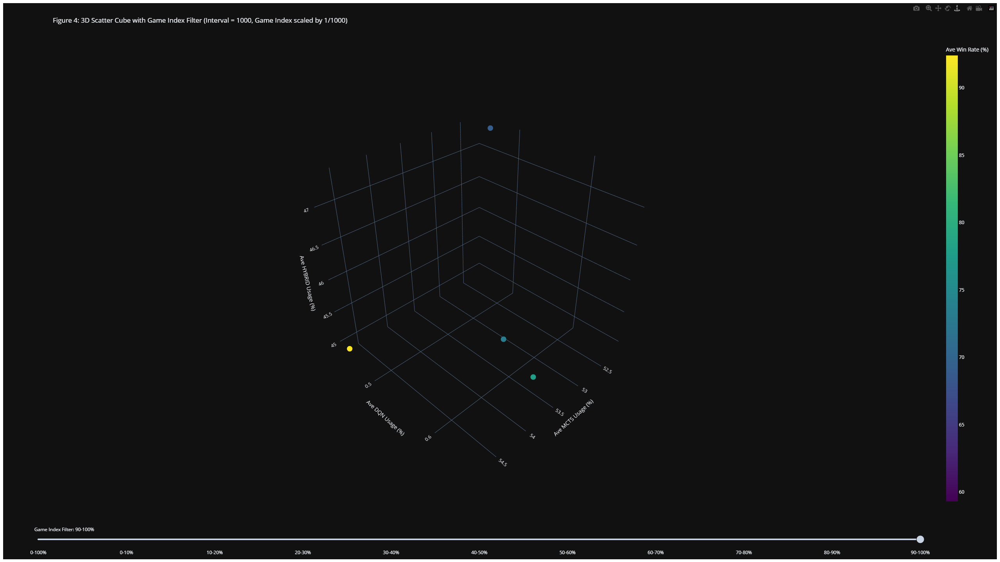
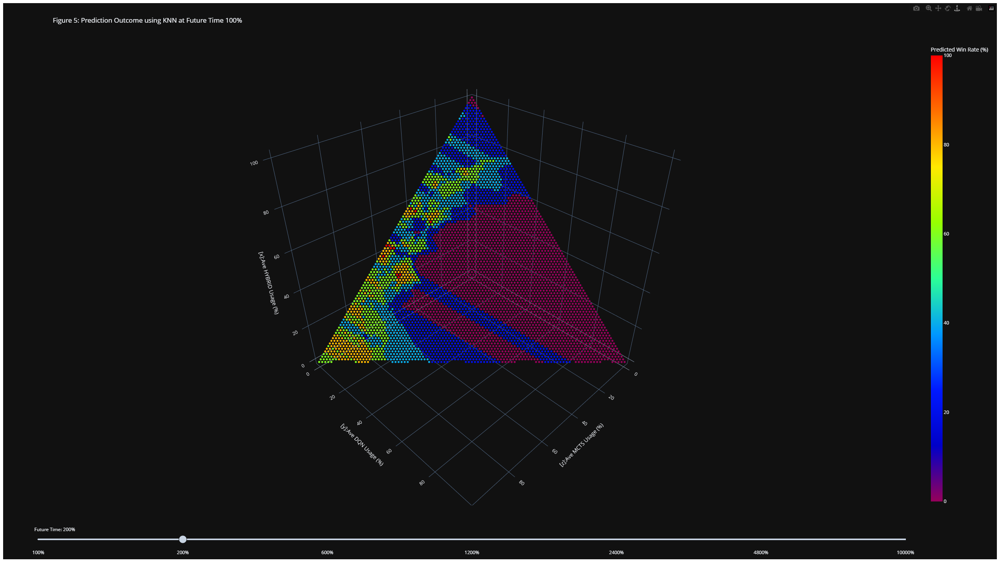

# Alpha Four

This repository implements a Deep Q-Network (DQN) approach to play Connect4. It leverages Monte Carlo Tree Search (MCTS) with deep reinforcement learning for optimized decision-making. The model uses PyTorch for training, Numba/CUDA for fast simulations, and parallel training using Python's multiprocessing.
For a detailed explanation of the logic and implementation, please refer to  [Optimized MCTS with DQN in Connect Four Environment](Optimized_MCTS_with_DQN_in_Connect_Four_Environment.pdf)


Table of Contents
-----------------
-   [Objective](#objective)
-   [Features](#features)
-   [Installation](#installation)
-   [Project Structure](#project-structure)
-   [Requirements](#requirements)
-   [Usage](#usage)
    -   [Tune HyperParameter](#tune-hyperparameter)
    -   [Training](#training)
    -   [Evaluation](#evaluation)
    -   [Data Visualizations](#data-visualizations)
    -   [Analysis](#analysis)
   
-   [TODO / Roadmap](#todo--roadmap)
-   [License](#license)
* * * * *

Objective
--------

- This project not only demonstrates that AI can achieve superhuman performance in Connect Four through the integration of Deep Q-Networks (DQN) and Monte Carlo Tree Search (MCTS), but also proposes a novel simulation-based framework for adaptive learning. 
- By combining MCTS with artificial neural networks (ANNs), we can simulate the environment and observe the convergence of strategies throughout training—offering significantly better performance than random tree-based approaches. 
- My aim is to build a reusable and extendable framework that supports environment simulation, adaptive learning, and high-accuracy prediction, alongside dynamic data visualization. 
- Connect Four serves as the primary testbed to validate this approach and prove its effectiveness both as a research tool and a foundation for broader AI applications.

* * * * *

Features
--------

-   **Connect4 Environment**: Lightweight environment class (`Connect4`) with board management, move validity checks, and win/draw detection.
-   **DQN Model**: Convolutional for the Q-network, supporting 6×7 board input.
-   **Disk-Based Replay Buffer**: Large replay capability via memory-mapped files.
-   **MCTS**: Optional fallback or standalone strategy, guided by DQN-based heuristics if enabled.
-   **GPU-Accelerated Simulations**: Numba-based CUDA kernels for MCTS: simulating random Connect4 games in parallel.
-   **Evaluation Suite**: Scripts for auto evaluation (model vs. random, MCTS, or other DQN models) and a GUI for human vs. AI.


* * * * *

Installation
-----------------
## [Download the latest Alpha-Four (.exe) for Windows](https://yutomorimori.com/AlphaFour/download/v0.4.6/app.exe)
### Minimum Requirements
**RAM**: 8GB

**Storage**: 5GB available

**CPU**: A processor that performs better than an 8th generation Intel i5 (for example, an i5-8400 or equivalent)

**GPU**: Integrated graphics (the graphics processor built into the CPU)

### Recommended Requirements
**RAM**: 16GB

**Storage**: 5GB available

**CPU**: A processor that outperforms a 10th generation Intel i5 (for example, an i5-10400 or similar)

**GPU**: A dedicated graphics card with performance at or above the level of an Nvidia GTX 750 with cuda v11.8 installation 


* * * * *
Project Structure
-----------------

```
project/
├── data/                                
│   ├── models/                           # saved models.
│   ├── dat/                              # saved replaybuffer.dats
│   └── logs/                              # saved logs
├── dependencies/
│   ├── __init__.py
│   ├── agent.py                       # AgentLogic, reward functions
│   ├── environment.py                 # Connect4 environment class
│   ├── mcts.py                        # Monte Carlo Tree Search
│   ├── models.py                      # DQN architectures
│   ├── replay_buffer.py               # Disk-based replay buffer
│   └── utils.py                       # Common utilities (logging, CUDA kernels, etc.)
├── evaluate_model/
│   ├── __init__.py
│   ├── logs/
│   │   └── ...                        # Logs for evaluations
│   ├── auto_evaluation.py             # Automatic matchups (DQN vs random/MCTS/other DQN)
│   ├── manual_evaluation.py           # GUI for human vs AI
│   └── plot.py                        # Parses logs & produces performance plots
├── train_model/
│   ├── __init__.py
│   └── train.py                       # Main training script for the DQN agent
├── README.md                          
├── requirements.txt                   # Python dependencies
└──Optimized_MCTS_with_DQN_in_Connect_Four_Environment.pdf # explains logics
```
### Key Directories

-   **`dependencies/`**: Core modules (environment, MCTS, DQN model, replay buffer, etc.) used by both training and evaluation scripts.
-   **`train_model/`**: Contains `train.py`, the primary training entry point.
-   **`evaluate_model/`**: Scripts for evaluating a trained model (auto vs. random/MCTS, or human vs. AI via GUI). Also includes plotting utilities.

* * * * *

Requirements
-----------------------------

1.  **Clone** this repository or download the ZIP.
2.  **Create a virtual environment** (recommended):

```bash
python -m venv venv
source venv/bin/activate   # Linux/macOS
venv\Scripts\activate      # Windows`
```
3.  **Install dependencies**:

```bash
pip install -r requirements.txt
```
4.  **Verify** that PyTorch is set up correctly with CUDA if you plan to use GPU acceleration for training or Numba-based simulations.

* * * * *

Usage
-----

### Tune Hyperparameter
#### Hardware Hyperparameters
- DEVICE :This parameter sets the computation device. It uses PyTorch’s mechanism to choose a CUDA-enabled GPU if available, otherwise it falls back to the CPU. This is crucial for accelerating both training and inference when a GPU is present.

- NUM_WORKERS: Specifies the number of worker processes used for data loading. Increasing this number can improve data throughput during training by parallelizing data fetching and preprocessing tasks.

#### Model Hyperparameters: 
- MODEL_VERSION:An identifier used to tag the version of the model. It helps in organizing saved model files and tracking different experimental versions.

- BATCH_SIZE: The number of training samples processed in one iteration. A batch size of 128 means that the model weights are updated after processing 128 samples.

- GAMMA: The discount factor used in reinforcement learning. A value of 0.95 indicates that future rewards are considered almost as important as immediate rewards, but with a slight discount.

- LR (Learning Rate): Determines the step size during the optimization process. A smaller learning rate (0.0001) suggests careful, incremental updates to the model weights, which can help in achieving stable convergence.

- TARGET_EVALUATE and TARGET_UPDATE: These parameters are likely tied to updating a target network, a common strategy in Deep Q-Networks (DQN). They dictate how frequently the target network (used for stable learning) is updated relative to the primary network.

- EVAL_FREQUENCY: Sets how often (in terms of training iterations or episodes) the model is evaluated. Regular evaluation helps monitor training progress and adjust parameters if needed.

- EPSILON_DECAY and EPSILON_MIN: These control the exploration strategy in an epsilon-greedy policy:
    - EPSILON_DECAY (0.99) gradually reduces the exploration rate over time.
    - EPSILON_MIN (0.05) ensures that there’s always a minimum level of exploration, preventing the agent from getting stuck in a local optimum.
- SELF_PLAY: Specifies the number of self-play iterations or episodes, which is common in reinforcement learning frameworks to generate training data by having the agent play against itself.

- DEBUGMODE: A flag to enable or disable additional logging or diagnostic features. When set to True, it may provide more detailed runtime information useful during development or troubleshooting.

#### MCTS Hyperparameters
- WIN_RATE_WINDOW: Defines the number of recent episodes used to calculate the win rate. This rolling window helps smooth out fluctuations and gives a more stable performance metric.

- MAX_MCTS: Indicates the maximum number of iterations or simulations for the Monte Carlo Tree Search (MCTS). A higher number allows for a more thorough search at the expense of increased computation time.

- MIN_EPISODES_PER_LEVEL: Sets the minimum number of episodes required at each training level before advancing to a higher level of difficulty or complexity. This ensures sufficient learning at each stage.

- WIN_RATE_THRESHOLD: Establishes the minimum win rate (80% in this case) that the agent must achieve to progress from the current MCTS level. This criterion helps maintain a standard of performance before moving on to more challenging tasks.

- File Paths Under the dat/ Directory: MODEL_SAVE_PATH and EVAL_MODEL_PATH
These formatted strings determine where the trained model and evaluation model are saved, incorporating the MODEL_VERSION to organize different iterations effectively.

- LOGS_DIR and LOG_FILE: Define the locations for storing training logs. Keeping detailed logs is essential for debugging, performance tracking, and analysis during and after training.

### Training

1.  **Set up** your parameters in `train_model/train.py` (e.g. batch size, learning rate, replay buffer capacity).
2.  **Run**:

```bash
py -m train_model.train
```
3.  Training logs and model checkpoints will be stored in the paths configured in `train.py` (often `dat/` or wherever you specify).

### Evaluation

1.  **Automated evaluation**: 
To evaluate the performance of the AI via a automate testing using a model vs. random, MCTS, and another model:
```bash
py -m auto_evaluation
```
-   Modify arguments (model paths, number of games, etc.) inside `auto_evaluation.py`.

2.  **Manual evaluation**: Compare your trained model vs. random, MCTS, or another model:

To evaluate the performance of the AI via a GUI:
```bash
py -m manual_evaluation
```

3.  **Plot results**:\
If you have log files (e.g. `train.log`), you can generate plots by:

```bash
py -m plot
```
-   This script reads from a log file (like `train.log`) and outputs charts of win rates, rewards, etc.


-   A **Connect4** window appears, where you can drop your discs, and the AI responds.
-   Useful for demos or quick sanity checks.

* * * * *
Data Visualizations
--------------

#### Figure 1: Main Values Over Time 

[Interact with Figure 1](https://yutomorimori.com/figure1.html)
- Visualizes the evolution of decision-making—from initial MCTS dominance to a gradual shift toward DQN and hybrid strategies.  
  

#### Figure 2: Epsilon vs. MCTS Level 
   
   [Interact with Figure 2](https://yutomorimori.com/figure2.html)
- Shows that higher simulation levels (focusing on long-term planning) correspond to lower epsilon values, indicating a shift in strategy as midterm win scenarios (levels around 500–700) are encountered.  
  

#### Figure 3: Contribution to Winning
  
  [Interact with Figure 3](https://yutomorimori.com/figure3.html)
   - Illustrates the contributions of pure MCTS, MCTS-supervised DQN, and the hybrid MCTS+DQN to overall win rates.  
  

#### Figure 4: 3D Visualization of Models
  
  [Interact with Figure 4](https://yutomorimori.com/figure4.html)
- Offers a spatial perspective of performance dynamics across the three models.  
  

#### Figure 5: KNN-Predicted Future Win Rate Post-Training Multiplier**
  
  [Interact with Figure 5](https://yutomorimori.com/figure5.html)
- Building on Figure 4, Figure 5 applies a KNN (k-nearest neighbors) regression model to predict future win rate outcomes after applying a training multiplier. The scatter points represent the performance metrics from the three approaches, as seen in Figure 4, where each point corresponds to features such as simulation count, DQN confidence, and the observed win rate.

- A KNN model is fitted on these data points, generating a smooth prediction curve that projects the win rate evolution under the influence of the new training multiplier. A secondary axis or color gradient in the visualization indicates the multiplier effect, illustrating how changes in training intensity affect win rate. Confidence bands around the prediction curve denote the uncertainty in the forecast, especially in areas with sparse data.

- The figure contrasts current performance (scatter points) with predicted performance (KNN curve), demonstrating an upward trend in win rate as the hybrid model leverages the enhanced training dynamics.

* * * * *
Analysis
--------------
#### Unsupervised DQN Training
- **Training Stability:** Training was unstable, with ineffective learning and a tendency to overfit.
- **Performance:** The model could only beat random agents.

#### MCTS-Supervised DQN Training
- **Supervised Learning:** Training DQN with supervision from MCTS resulted in approximately an 80% win rate against MCTS at the 480 simulation level (with 100 simulations per window).

#### Hybrid Approach – MCTS + DQN Fusion
- **Integration:** Integrated DQN layers into the MCTS framework.
- **Dynamic Switching:** The model dynamically switches based on the "statistical confidence" of each method:
  - **MCTS:** Confidence is derived from simulation counts (e.g., 2000 simulations identifying the move with the highest win rate).
  - **DQN:** Softmaxed Q-values are used to gauge confidence.
- **Heuristics:** Simple heuristics (e.g., block/fill strategies for four-in-a-row) are used alongside DQN layers for enhanced decision-making.
- **Results:** The hybrid MCTS+DQN model is still being fine-tuned, but it has already demonstrated a more stable learning process, improved performance, and effectiveness—marking a 50% improvement over the MCTS-supervised DQN model.

* * * * *

TODO / Roadmap
--------------
-   **Hyperparameter Tuning**: Further refine network size, learning rate, or MCTS parameters.
* * * * *

License
-------

Apache License 2.0 – You are free to use, modify, and distribute this software under the terms of the Apache License, Version 2.0. See the LICENSE file for details.

* * * * *
